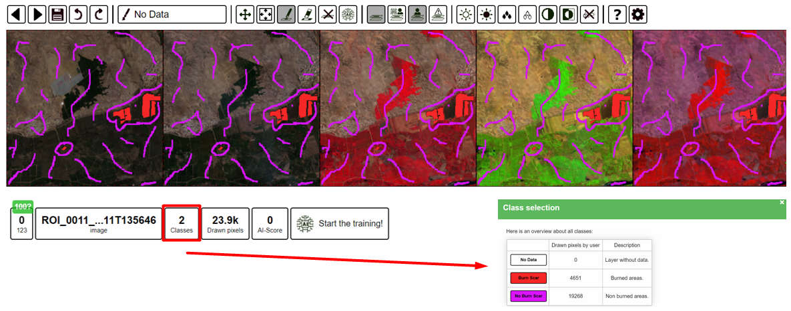
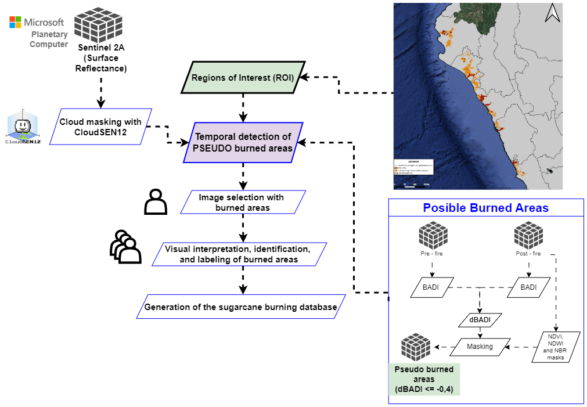
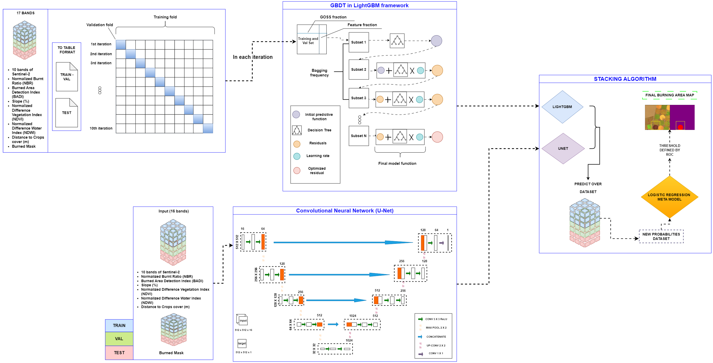
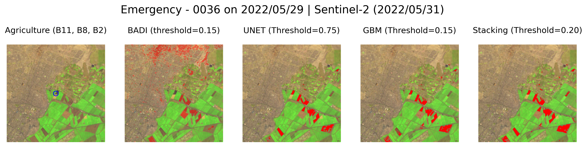

# 🌱 Sugar Cane Burning Detection in North and Central Coast of Peru 🔥

### 📜 [Project Page](https://jfloresf17.github.io/scburningweb) | 💻 [Thesis](https://github.com/jfloresf17/scburning_latex) | 📈 [Data](https://huggingface.co/datasets/jfloresf/scburning) | 📏 [Experiment Logs](https://wandb.ai/scigeo/scburning)
[](https://colab.research.google.com/drive/1Yl2Rxv4e45JJ-ydmpUbXPAxVd0OZ7gNz?usp=sharing)

<p align="center">
  
</p>

This repository provides an implementation of an ensemble model for detecting sugar cane burning in the North and Central Coast of Peru. The model combines 📈 **Logistic Regression**, 🧠 **U-Net**, and 📊 **LightGBM** to accurately identify sugar cane burning events.

- **U-Net** abstracts the spatial features from satellite images.
- **LightGBM** extracts tabular features and predicts the burning pixel-wise probabilities.

- **Stacking Model** combines the predictions from U-Net and LightGBM to generate the final output.

Let's get started and detect sugar cane burning together! 🌱🔥

## 🛠️ Installation Requirements
To run the code, you need a few dependencies. If you're using Conda, create a new environment and install the requirements with these commands:

```bash
conda create -n scburning python=3.11
conda activate scburning
pip install -r requirements.txt
```

## 💾 Data
The dataset is available via the Hugging Face Datasets library. To download it, use the following commands:

```bash
git clone https://huggingface.co/datasets/jfloresf/scburning
cd scburning
```

Revert the multipart compression by merging and extracting:

```bash
cat database/database.tar.* | tar -xzvf - -i
cat inference/emergencies/emergencies.tar.* | tar -xzvf - -i
cat inference/pilot/pilot.tar.* | tar -xzvf - -i
```

The dataset consists of 1,054 images (🖼 512x512 pixels), organized into different folders:

- **Sentinel-2 10 bands** (`S2`)
- **Normalized Burn Ratio** (`nbr`)
- **Burned Area Detection Index** (`badi`)
- **Slope in percentage** (`slope`)
- **Normalized Difference Vegetation Index** (`ndvi`)
- **Normalized Difference Water Index** (`ndwi`)
- **Distance to Crop Cover** (`dlc`)
- **Ground Truth** (`target`)

Additionally, the dataset includes the **emergencies** (`58 images`) and **pilot** (`30 images`) folders for inference purposes with the same structure, except for the **Ground Truth** subfolder.

### Folder Structure
```
database/
├── badi/
│   ├── ROI_0000_01_04__..._20201008T082324.tif
|   ├── ...
├── dlc/
│   ├── ROI_0000_01_04__..._20201008T082324.tif
|   ├── ...
├── nbr/
│   ├── ROI_0000_01_04__..._20201008T082324.tif
|   ├── ...
├── ndvi/
│   ├── ROI_0000_01_04__..._20201008T082324.tif
|   ├── ...
|── ndwi/
|   ├── ROI_0000_01_04__..._20201008T082324.tif
|   ├── ...
|── slope/
|   ├── ROI_0000_01_04__..._20201008T082324.tif
|   ├── ...
|── S2/
|   ├── ROI_0000_01_04__..._20201008T082324.tif
|   ├── ...
|── target/
|   ├── ROI_0000_01_04__..._20201008T082324.tif
|   ├── ...
```

The labels were generated using the [IRIS](https://github.com/ESA-PhiLab/iris) platform according to the configuration in [iris_metadata.json](https://github.com/jfloresf17/scburning/blob/main/iris_metadata.json).

<p align="center">
  
</p>

## 🗃️ Workflow of Data Processing
Here's a workflow diagram showing how data was processed and prepared for training the models:

<p align="center">
  
</p>

## 🧪 Ensemble Model Workflow
Here's how our ensemble model works in practice:

<p align="center">
  
</p>

## 🏆 Results
### 📈 Quantitative Results
Below are the metrics for **U-Net**, **LightGBM**, and the **Stacking Model**:

| **Metric**           | **U-Net** | **LightGBM** | **Stacking Model** |
|------------------------|-----------|--------------|---------------------|
| **F1 (↑)**            | 67.2      | 86.0         | **90.6**           |
| **Recall (↑)**        | 77.2      | 93.8         | **95.3**           |
| **Precision (↑)**     | 60.2      | 79.3         | **86.4**           |
| **IoU (↑)**           | 51.1      | 75.4         | **82.8**           |
| **Kappa (↑)**         | 67.5      | 81.2         | **87.5**           |

### 🖼 Qualitative Results
<p align="center">
  <video width="80%" src="assets/oefa_val.mp4">
</p>

### 🛡️ Difference Between Models
Using **BADI** as a conventional index for sugar cane burning detection, the image below shows the comparison among **U-Net**, **LightGBM**, and the **Stacking Model**:

<p align="center">
  
</p>

### 🛠️ Inference in Pilot Area
<p align="center">
  
</p>

## 👨‍💻 Inference (Try the Model)
### 🔗 Pre-trained Models
You can use the pre-trained models available here:

| **Model**           | **Link** | **Size** |
|---------------------|-----------|----------|
| **U-Net**           | [📥 Download](https://huggingface.co/datasets/jfloresf/scburning/resolve/main/models/resnet50_norm_075.ckpt) | 391 MB |
| **LightGBM**        | [📥 Download](https://huggingface.co/datasets/jfloresf/scburning/resolve/main/models/gbm.zip) | 251 kB |
| **Stacking Model**  | [📥 Download](https://huggingface.co/datasets/jfloresf/scburning/resolve/main/models/stacking_model.pkl) | 1.23 kB |

Try it out using our [Colab Notebook](https://colab.research.google.com/github/gee-community/geemap/blob/master).

## 📜 Citation
If you use this repository in your research, please consider citing our work:

```
@article{flores2024sugar,
  title={Desarrollo de un modelo de aprendizaje ensamblado para la detección de quema de caña de azúcar en la costa norte y centro del Perú durante el período 2017 - 2022},
  author={Flores, Jair},
  journal={arXiv preprint arXiv:2109.14713},
  year={2024}
}
```

🚀 Ready to start? Clone the repo, set up the environment, and let's detect sugar cane burning together! 🏤🌱🔥

