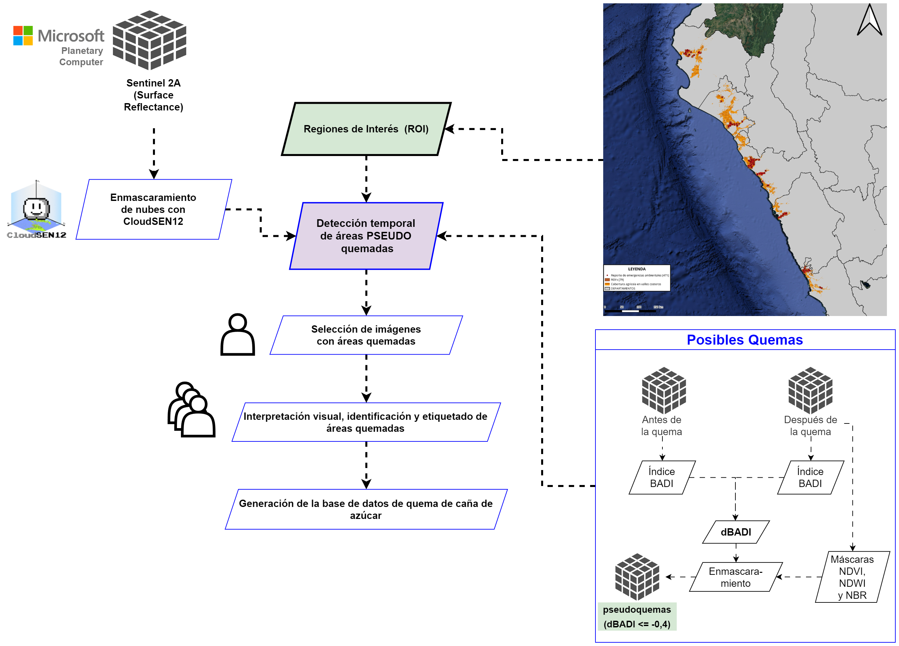

# Sugar Cane Burning Detection in North and Central Coast of Peru

### [Project Page](http://127.0.0.1:5500/index.html) | [Thesis](https://arxiv.org/abs/2109.14713) | [Data](https://huggingface.co/datasets/jfloresf/scburning) | [Experiment Logs](https://wandb.ai/scigeo/scburning)

<p align="center">
  
</p>

This repository contains an implementation of a ensembled model for sugar cane burning detection in North and Central Coast of Peru. The ensemble model is composed of a U-Net
architecture and a LightGBM model. 

The U-Net model is trained on the Sentinel-2 satellite images and the LightGBM model is trained on the NDVI index. The final prediction is

## Installation requirements

To install the required packages, run the following command:

```bash
conda create -n scburning python=3.11
conda activate scburning
pip install -r requirements.txt
```

## Data
The dataset is available in the Hugging Face Datasets library. To download the dataset, run the following command:

```bash
nohup download_data.sh > progress.log &
```
Or
```bash
git clone https://huggingface.co/datasets/jfloresf/scburning
cd scburning
```
Revert the multipart compression: merge first, then untar
```bash
cat database/database.tar.* | tar -xzvf - -i
cat inference/emergencies/emergencies.tar.* | tar -xzvf - -i
cat inference/pilot/pilot.tar.* | tar -xzvf - -i
```

Consists in 1,254 images of 512x512 pixels with different
folders: 'S2', 'NBR', 'BADI', 'SLOPE', 'NDVI', 'NDWI', 'LANDCOVER', 'TARGET' according the following structure:

```
database/
├── badi/
│   ├── ROI_1.tif
├── dlc/
│   ├── ROI_1.tif
```

The labels were generated using [IRIS](https://github.com/ESA-PhiLab/iris) platform according the [iris_metadatata.json](https://github.com/jfloresf17/scburning/blob/main/iris_metadata.json) config file.

Image of example of IRIS
<p align="center">
  
</p>

The workflow of the project is shown in the following image:
<p align="center">
  
</p>

## Training
<p align="center">
  
</p>

### LightGBM
Add image of the training process
<p align="center">
  
</p>

### U-Net
To train the U-Net model, run the following command:
```bash
nohup python experiment.sh > unet.out &
```
Add image of the training process

### Stacking Model
Add image of the training process

## Results 
Add metric results
<p align="center">
  
</p>

Add image of the prediction
<p align="center">
  
</p>

## Inference (try the model)
To try the model, run the following command:

```bash
nohup python inference.py --config config.yaml > inference.out &
```

## Citation
If you use this code for your research, please cite our paper:

```
@article{flores2024sugar,
  title={Desarrollo de un modelo de aprendizaje ensamblado para la detección de quema de caña de azúcar en la costa norte y centro del Perú durante el período 2017 - 2022},
  author={Flores, Jair},
  journal={arXiv preprint arXiv:2109.14713},
  year={2024}
}
```